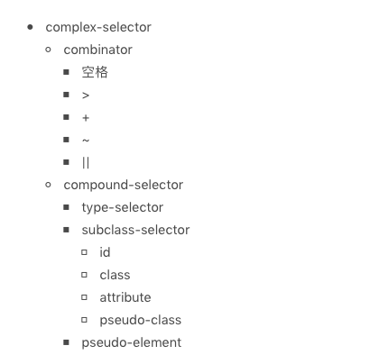

#### rem 和 em
* rem 和 em 单位是由浏览器基于你的设计中的字体大小计算得到的像素值。
* em 单位基于使用他们的元素的字体大小。
* rem是基于html元素的字体大小
* em 单位可能受任何继承的父元素字体大小影响
* rem 单位可以从浏览器字体设置中继承字体大小。
* 使用 em 单位应根据组件的字体大小而不是根元素的字体大小。
* 在不需要使用em单位，并且需要根据浏览器的字体大小设置缩放的情况下使用rem。
* 使用rem单位，除非你确定你需要 em 单位，包括对字体大小。
* 媒体查询中使用 rem 单位
* 不要在多列布局中使用 em 或 rem -改用 %。
* 不要使用 em 或 rem，如果缩放会不可避免地导致要打破布局元素。


#### @规则：

@charset
@import
@media
@page
@counter-style
@keyframes
@fontface
@supports
@namespace

#### 普通规则： 选择器 + 声明

选择器：




声明 => 属性：值

属性： 是由中划线、下划线、字母等组成的标识符，CSS 还支持使用反斜杠转义。我们需要注意的是：属性不允许使用连续的两个中划线开头，这样的属性会被认为是 CSS 变量。

```
:root {
  --main-color: #06c;
  --accent-color: #006;
}
/* The rest of the CSS file */
#foo h1 {
  color: var(--main-color);
}

```

值：


##### css支持一批特定的计算型函数：
* attr( <attr-name> <type-or-unit>? [ , <attr-fallback> ]? )
```
// demo - 2
height: attr(data-size em, 20);
// demo - 1
<span class="tooltip-toggle" aria-label="Sample text for your tooltip!" tabindex="0">

.tooltip-toggle::before { content: attr(aria-label); }
```
* calc(): 支持加减乘除
```
section {
  float: left;
  margin: 1em; border: solid 1px;
  width: calc(100%/3 - 2*1em - 2*1px);
}

```
* min(): 用于比较数值的大小并取出最小的那个。浏览器不支持？
```
div{font-size:min(30px, 3em);}
div{width:min(10% + 20px, 300px);}
```
* max(): 用于比较数值的大小并取出最大的那个。浏览器不支持？
```
div{font-size:max(30px, 3em);}
div{width:max(10% + 20px, 300px);}
```
* toggle(): 允许子孙元素使用取值序列中的值循环替换继承而来的值。
```
// 让一个列表项的样式圆点和方点间隔出现
ul {
    list-style-type: toggle(circle, square);
}
```

##### 背景函数
* url();
* linear-gradient、radial-gradient()、conic-gradient()、repeating-linear-gradient()、repeating-radial-gradient()、repeating-conic-gradient()：CSS中渐变相关的函数，可以通过这些函数绘制不同的渐变图像
* image-set()：可以根据不同的终端的dpr指定不同倍数的图像(部分浏览器支持)(实现Retina屏幕下图片显示)
* image()：其功能和url()函数类似，只是功能更为强大。比如，使用媒体片段剪辑出图像的一部分；指定回退图像；使用纯色作为图像；对具有方向性的图像进行注释
* element()：可以将网站中的某部分当作图片渲染(只有firefox支持)

##### 颜色函数
* rgb()
* rgba()
* hsl()
* hsla()
* hwb(): Hue色相、Saturation饱和度、Brightness明度

##### 图形函数
* shape-outside：none | [ <basic-shape> || <shape-box> ] | <image>
* clip-path：
* offset-path：

##### 滤镜函数
* filter: 
* background-filter:


# 选择器


### 全体选择器
```
* {
    font-size: 0;
}
```

### 类选择器
```
div {
    color: #fff;
}
```

### id选择器
```
#id {
    color: #f2f4f6;
}
```

### 类选择器
```
.cls {
    color: #fff;
}
```

### 属性选择器
```
/* 存在title属性的<a> 元素, 如下选择 */
a[title] {
  color: purple;
}

/* 存在href属性并且属性值匹配"https://example.org"的<a> 元素, 如下选择 */
a[href="https://example.org"] {
  color: green;
}

/* 存在href属性并且属性值包含"example"的<a> 元素, 如下选择 */
a[href*="example"] {
  font-size: 2em;
}

/* 存在href属性并且属性值结尾是".org"的<a> 元素, 如下选择 */
a[href$=".org"] {
  font-style: italic;
}

/* 存在href属性并且属性值以"#"开始的<a> 元素, 如下选择 */
a[href^="#"] {
  background-color: gold;
}

/* 所有包含`lang`属性并且属性值是以空格为间隔的值列表, 值列表中包含"en-us"的<div> 元素, 
设置css color:blue. */
div[lang~="en-us"] {
  color: blue;
}

/* 所有包含`lang`属性并且属性值匹配"zh"或 以"zh-"为开头的<div> 元素, 设置css color:red, 无论
   简体中文 (zh-CN) 或者 繁体中文 (zh-TW). */
div[lang|="zh"] {
  color: red;
}
```

### 伪类选择器
* 树结构关系伪类选择器
```
/* 匹配文档树的根元素 随着scope css等的出现还是很有用的 */
:root {
  --main-color: hotpink;
  --pane-padding: 5px 42px;
}

/* 没有子元素的元素 子元素只可以是元素节点或文本（包括空格） */
div:empty {
  background: lime;
}


:nth-child(an+b)
/* 与nth-child基本一样，只是从从结尾处反序计数，而不是从开头处 */
:nth-last-child(an+b)

element:nth-of-type(an+b) => nth-child(an+b of element)

:nth-last-of-type(an+b)

:first-child()

:last-child()

/* 属于某个父元素的唯一一个子元素 */
:only-child()
```
* 链接与行为伪类选择器
```
:link

:hover

:active

:focus

/* 浏览器hash指定元素 */
:target
```
* 逻辑伪类选择器
```
:not(X)

/* 类名不是 `.fancy` 的 <p> 元素 */
p:not(.fancy) {
  color: green;
}

/* 非 <div> 或 <span> 的元素 */
body :not(div):not(span) {
  font-weight: bold;
}
```
* 其他伪类选择器